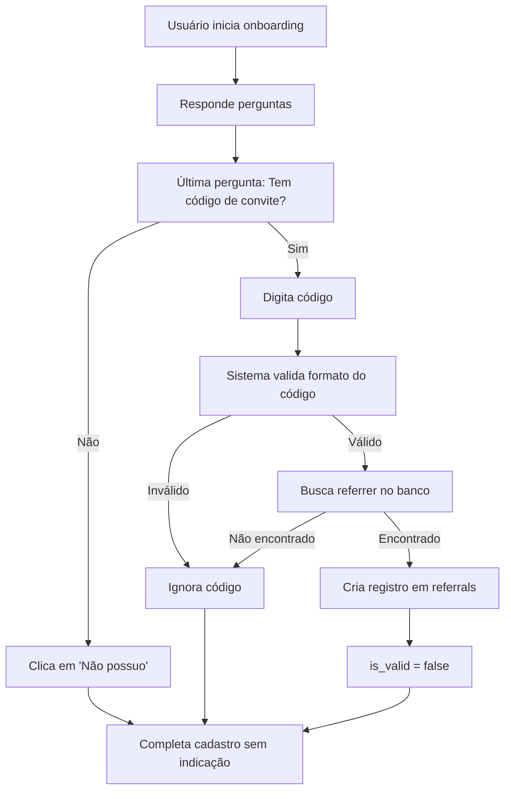
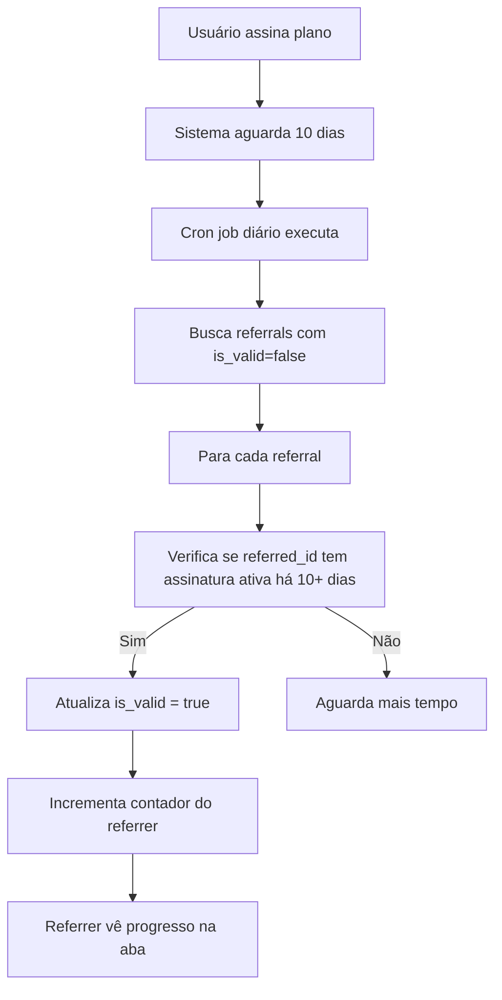
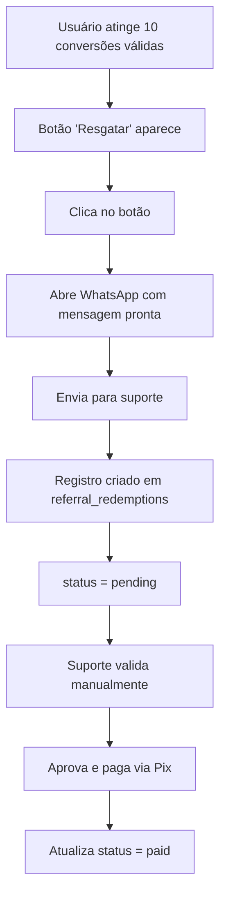

# Sistema "Indique a Palavra" - Documentação Completa

## 📋 Índice
1. [Visão Geral](#visão-geral)
2. [Como Funciona](#como-funciona)
3. [Configuração do Banco de Dados](#configuração-do-banco-de-dados)
4. [Estrutura das Tabelas](#estrutura-das-tabelas)
5. [Fluxo de Funcionamento](#fluxo-de-funcionamento)
6. [Sistema Antifraude](#sistema-antifraude)
7. [Validação Automática](#validação-automática)
8. [Administração](#administração)

---

## 🎯 Visão Geral

O sistema "Indique a Palavra" é um programa de indicação com recompensa financeira que permite aos usuários do app Notas-Bíblicas convidar amigos e ganhar R$ 20 via Pix ao completar 10 conversões válidas.

### Características Principais
- Código único de convite por usuário (6 caracteres)
- Pergunta opcional no onboarding para inserir código de indicação
- Validação automática após 10 dias de assinatura ativa
- Sistema antifraude completo
- Resgate via WhatsApp
- Interface intuitiva na sidebar

---

## 🚀 Como Funciona

### Para o Usuário que Indica
1. Acessa a aba "Indique a Palavra" na sidebar
2. Copia seu código único de convite
3. Compartilha com amigos
4. Acompanha o progresso na barra (0/10)
5. Quando atingir 10 conversões válidas, clica em "Resgatar via WhatsApp"
6. Envia mensagem automática para o suporte solicitando o Pix

### Para o Usuário Convidado
1. Recebe código de um amigo
2. Durante o onboarding, na última pergunta, insere o código (opcional)
3. Completa o cadastro e assina um plano
4. Após 10 dias de assinatura ativa, a indicação é validada automaticamente

### Regras de Validação
✅ **Conversão Válida:**
- Usuário usou código de convite válido
- Assinou um plano pago
- Manteve assinatura ativa por pelo menos 10 dias
- Não é autoindicação

❌ **Conversão Inválida:**
- Código inexistente ou inválido
- Não assinou nenhum plano
- Cancelou antes de 10 dias
- Tentou usar o próprio código

---

## ⚙️ Configuração do Banco de Dados

### Passo 1: Executar Script SQL

Acesse o **SQL Editor** do Supabase e execute o arquivo:
```
docs/sql/referral_system.sql
```

Este script irá:
1. Adicionar campo `referral_code` na tabela `profiles`
2. Criar tabela `referrals` (indicações)
3. Criar tabela `referral_redemptions` (resgates)
4. Configurar políticas RLS (Row Level Security)
5. Criar funções auxiliares de validação

### Passo 2: Gerar Códigos para Usuários Existentes

Se você já tem usuários cadastrados, execute:

```sql
UPDATE profiles
SET referral_code = UPPER(SUBSTRING(MD5(RANDOM()::TEXT) FROM 1 FOR 6))
WHERE referral_code IS NULL;
```

### Passo 3: Verificar Permissões

Certifique-se de que as políticas RLS estão ativas:

```sql
-- Verificar RLS em referrals
SELECT schemaname, tablename, rowsecurity
FROM pg_tables
WHERE tablename = 'referrals';

-- Verificar RLS em referral_redemptions
SELECT schemaname, tablename, rowsecurity
FROM pg_tables
WHERE tablename = 'referral_redemptions';
```

---

## 🗄️ Estrutura das Tabelas

### Tabela: `profiles`
```sql
ALTER TABLE profiles
ADD COLUMN referral_code VARCHAR(8) UNIQUE;
```

**Campos adicionados:**
- `referral_code`: Código único do usuário (ex: "ABC123")

---

### Tabela: `referrals`
```sql
CREATE TABLE referrals (
  id UUID PRIMARY KEY,
  referrer_id UUID,      -- Quem indicou
  referred_id UUID,      -- Quem foi indicado
  referral_code VARCHAR(8),
  is_valid BOOLEAN,      -- true após 10 dias de assinatura ativa
  validated_at TIMESTAMPTZ,
  created_at TIMESTAMPTZ,
  updated_at TIMESTAMPTZ
);
```

**Constraints:**
- `no_self_referral`: Impede autoindicação
- `unique_referred`: Um usuário só pode ser indicado uma vez

---

### Tabela: `referral_redemptions`
```sql
CREATE TABLE referral_redemptions (
  id UUID PRIMARY KEY,
  user_id UUID,
  referral_code VARCHAR(8),
  conversions_count INTEGER,
  status VARCHAR(20),    -- pending, approved, paid
  redeemed_at TIMESTAMPTZ,
  approved_at TIMESTAMPTZ,
  paid_at TIMESTAMPTZ
);
```

---

## 🔄 Fluxo de Funcionamento

### 1. Cadastro do Novo Usuário (Onboarding)



### 2. Validação Automática (Após 10 Dias)



### 3. Resgate (Ao Atingir 10 Conversões)



---

## 🛡️ Sistema Antifraude

O sistema possui proteções automáticas contra fraudes:

### 1. Autoindicação
**Bloqueio:** Constraint no banco impede `referrer_id = referred_id`

```sql
CONSTRAINT no_self_referral CHECK (referrer_id != referred_id)
```

### 2. Múltiplas Indicações
**Bloqueio:** Um usuário só pode ser indicado uma vez

```sql
CONSTRAINT unique_referred UNIQUE (referred_id)
```

### 3. Indicações em Massa
**Detecção:** Função `detectSuspiciousActivity()` alerta se:
- Mais de 10 indicações em 24 horas
- Múltiplos cancelamentos rápidos (<15 dias)

### 4. Validação de 10 Dias
**Regra:** Só conta conversão se assinatura permanecer ativa por 10 dias completos.

### 5. Logs de Auditoria
Todas as ações são logadas:
- Criação de indicações
- Validações
- Resgates
- Atividades suspeitas

---

## ⏰ Validação Automática

### Opção 1: Cron Job no Supabase (Recomendado)

Configure um **Scheduled Function** no Supabase para rodar diariamente:

```typescript
// supabase/functions/validate-referrals/index.ts
import { serve } from 'https://deno.land/std@0.177.0/http/server.ts'
import { createClient } from 'https://esm.sh/@supabase/supabase-js@2'

serve(async (req) => {
  const supabaseUrl = Deno.env.get('SUPABASE_URL')!
  const supabaseKey = Deno.env.get('SUPABASE_SERVICE_ROLE_KEY')!
  const supabase = createClient(supabaseUrl, supabaseKey)

  // Buscar indicações pendentes
  const { data: pendingReferrals } = await supabase
    .from('referrals')
    .select('*')
    .eq('is_valid', false)

  let validatedCount = 0

  for (const referral of pendingReferrals || []) {
    const tenDaysAgo = new Date()
    tenDaysAgo.setDate(tenDaysAgo.getDate() - 10)

    // Verificar assinatura ativa há 10+ dias
    const { data: subscription } = await supabase
      .from('subscriptions')
      .select('*')
      .eq('user_id', referral.referred_id)
      .eq('status', 'active')
      .lte('created_at', tenDaysAgo.toISOString())
      .single()

    if (subscription) {
      // Validar indicação
      await supabase
        .from('referrals')
        .update({
          is_valid: true,
          validated_at: new Date().toISOString(),
        })
        .eq('id', referral.id)

      validatedCount++
    }
  }

  return new Response(
    JSON.stringify({ validatedCount }),
    { headers: { 'Content-Type': 'application/json' } }
  )
})
```

**Agendar:**
- Dashboard do Supabase → Edge Functions
- Criar nova função com o código acima
- Configurar Cron: `0 3 * * *` (todo dia às 3h)

### Opção 2: Webhook no Sistema de Pagamentos

Configure um webhook no Stripe/outro gateway para chamar quando:
- Assinatura completar 10 dias
- Assinatura for cancelada

### Opção 3: Job Externo (Node.js/Python)

Use o arquivo `/src/lib/validate-referrals.ts`:

```typescript
import { validateAllPendingReferrals } from './lib/validate-referrals'

// Executar diariamente
validateAllPendingReferrals()
```

---

## 🔧 Administração

### Queries Úteis

**1. Ver indicações de um usuário:**
```sql
SELECT * FROM referrals
WHERE referrer_id = 'USER_UUID'
ORDER BY created_at DESC;
```

**2. Ver usuários prontos para resgate:**
```sql
SELECT
  referrer_id,
  COUNT(*) as valid_conversions
FROM referrals
WHERE is_valid = true
GROUP BY referrer_id
HAVING COUNT(*) >= 10;
```

**3. Ver resgates pendentes:**
```sql
SELECT * FROM referral_redemptions
WHERE status = 'pending'
ORDER BY redeemed_at DESC;
```

**4. Aprovar resgate:**
```sql
UPDATE referral_redemptions
SET
  status = 'approved',
  approved_at = NOW()
WHERE id = 'RESGATE_UUID';
```

**5. Marcar resgate como pago:**
```sql
UPDATE referral_redemptions
SET
  status = 'paid',
  paid_at = NOW(),
  payment_method = 'Pix',
  payment_details = 'Pago em DD/MM/AAAA'
WHERE id = 'RESGATE_UUID';
```

**6. Detectar atividades suspeitas:**
```sql
-- Indicações em massa (>10 em 24h)
SELECT
  referrer_id,
  COUNT(*) as count
FROM referrals
WHERE created_at >= NOW() - INTERVAL '24 hours'
GROUP BY referrer_id
HAVING COUNT(*) > 10;

-- Cancelamentos rápidos
SELECT
  r.referrer_id,
  COUNT(*) as quick_cancellations
FROM referrals r
JOIN subscriptions s ON r.referred_id = s.user_id
WHERE
  s.status = 'canceled'
  AND s.canceled_at - s.created_at < INTERVAL '15 days'
GROUP BY r.referrer_id
HAVING COUNT(*) > 3;
```

---

## 📊 Métricas e Relatórios

### Dashboard Administrativo

Crie visualizações para:

1. **Total de Indicações**
   - Válidas vs. Pendentes
   - Taxa de conversão

2. **Resgates**
   - Pendentes
   - Aprovados
   - Pagos
   - Total pago em R$

3. **Top Indicadores**
   - Usuários com mais conversões
   - Usuários que resgataram

4. **Detecção de Fraude**
   - Atividades suspeitas
   - Indicações bloqueadas

---

## 🎨 Interface do Usuário

### Localização
**Sidebar → Aba "Indique a Palavra"**

### Elementos da Tela
1. **Título e Descrição**
2. **Código de Convite** (campo + botão copiar)
3. **Barra de Progresso** (0/10)
4. **Regra de Validação** (explicação dos 10 dias)
5. **Valor da Recompensa** (R$ 20,00)
6. **Botão de Resgate** (aparece em 10/10)
7. **Informações Adicionais**

---

## 🐛 Troubleshooting

### Problema: Código não é gerado
**Solução:** Execute a função de geração para usuários existentes (SQL acima)

### Problema: Indicação não valida após 10 dias
**Possíveis causas:**
- Cron job não está rodando
- Assinatura foi cancelada antes dos 10 dias
- Usuário não tem assinatura ativa

**Verificar:**
```sql
SELECT * FROM subscriptions WHERE user_id = 'USER_UUID';
```

### Problema: Botão de resgate não aparece
**Verificar:**
```sql
SELECT COUNT(*) FROM referrals
WHERE referrer_id = 'USER_UUID' AND is_valid = true;
```

---

## 📞 Suporte

Para dúvidas sobre o sistema:
- **WhatsApp:** +55 64 99201-6685
- **E-mail:** md2.double@gmail.com

---

## 📄 Licença

Sistema proprietário © 2026 Notas-Bíblicas
